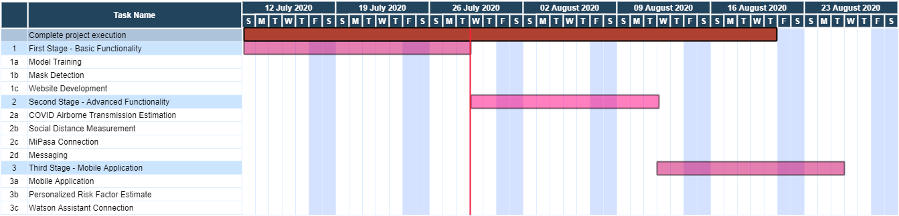

<h1 align="center" style="border-bottom: none;"> CovItOut </h1>
<h3 align="center">CovItOut uses deep learning algorithms to analyze input from security cameras in order to check how well the risk of COVID spread is mitigated in buildings, be it offices, malls, small shops, schools.</h3>

</p>
</p>
[](https://biteable.com/watch/embed/codecovout-2662382)

COVID-19 has so far affected several million lives and businesses across the world. It is vital that we  develop the tools we need so we can return to an economic life as close to normal as possible, while fully protecting our lives and the lives of those around us.
Our solution checks how well the risk of COVID spread is mitigated in buildings, be it offices, malls, small shops, schools, etc. We designed it to be able to be deployed easily in a large variety of places, and to be very easy to use. It doesn't need extra hardware other than access to the feed from the existing security cameras. It is enough to efficiently and effectively assess the situation and warn when the risk of infection grows.
From the security cameras footage, we can detect when workers or customers inside the building are not wearing masks, or are not keeping the proper distance. Uniquely to our solution, we take into account the growing number of scientists who argue that COVID-19 spreads through airborne micro-particles (aerosols) and we devised an algorithm to estimate the number of micro-particles in the air.
According to the Health Ministry guidelines in combination to the severity of the virus infection in each place (information obtained from MiPasa data), the application alerts the manager (or designated person) of the potential dangerous situation so the appropriate measures will be taken.
Also, the application can provide potential customers information related to how safe it is to enter the building. This can be displayed on the website of the company, on a screen at the entrance or trough an application on the customer's phone. 

### Example of usage for the mobile app
A potential customer in a Mall can check through his application in which shops she can enter. By passing in front of the shop, the application will take into account the situation inside the shop and also eventual co-morbidities and general health of the customer and display a color code for that shop that is personalized for the her: Green if it's ok to come in without worry, Yellow if it's a small risk, Red if entrance is not safe.
### The Aplication So Far
Main Screen:


### Aplication Structure

<p align="center">
  
</p>

### Roadmap
Much remains to be developed. This is our roadmap for the near future:
<p align="center">
  
</p>

## Prerequisites

### Public Cloud

1. Sign up for an [IBM Cloud account](https://console.bluemix.net/registration/).
1. Download the [IBM Cloud CLI](https://console.bluemix.net/docs/cli/index.html#overview).
1. Create an instance of the Visual Recognition service and get your credentials:
   - Go to the [Visual Recognition](https://console.bluemix.net/catalog/services/visual-recognition) page in the IBM Cloud Catalog.
   - Log in to your IBM Cloud account.
   - Click **Create**.
   - Click **Show** to view the service credentials.
   - Copy the `apikey` value.
   - Copy the `url` value.

## Configuring the application

Depending on where your service instance is you may have different ways to download the credentials file.

> Need more information? See the [authentication wiki](https://github.com/IBM/node-sdk-core/blob/master/AUTHENTICATION.md).

### Automatically

Copy the credential file to the application folder.

**Public Cloud**

<p align="center">
  
</p>

### Manually

1.  In the application folder, copy the _.env.example_ file and create a file called _.env_

    ```
    cp .env.example .env
    ```

2.  Open the _.env_ file and add the service credentials depending on your environment.

    Example _.env_ file that configures the `apikey` and `url` for a Watson Visual Recognitions service instance hosted in the US East region:

    ```
    WATSON_VISION_COMBINED_APIKEY=X4rbi8vwZmKpXfowaS3GAsA7vdy17Qh7km5D6EzKLHL2
    WATSON_VISION_COMBINED_URL=https://gateway-wdc.watsonplatform.net/visual-recognition/api
    ```

## Running locally

1. Install the dependencies

   ```
   npm install
   ```

1. Build the application

   ```
   npm run build
   ```

1. Run the application

   ```
   npm run dev
   ```

1. View the application in a browser at `localhost:3000`

## Deploying to IBM Cloud as a Cloud Foundry Application

Click on the button below to deploy this demo to the IBM Cloud.

[](https://cloud.ibm.com/devops/setup/deploy?repository=https://github.com/watson-developer-cloud/visual-recognition-code-pattern)

### Manually

1. Build the application

   ```
   npm run build
   ```

1. Login to IBM Cloud with the [IBM Cloud CLI](https://console.bluemix.net/docs/cli/index.html#overview)

   ```
   ibmcloud login
   ```

1. Target a Cloud Foundry organization and space.

   ```
   ibmcloud target --cf
   ```

1. Edit the _manifest.yml_ file. Change the **name** field to something unique. For example, `- name: my-app-name`.
1. Deploy the application

   ```
   ibmcloud app push
   ```

1. View the application online at the app URL, for example: https://my-app-name.mybluemix.net

## Tests

#### Unit tests

Run unit tests with:

```
npm run test:components
```

See the output for more info.

#### Integration tests

First you have to make sure your code is built:

```
npm run build
```

Then run integration tests with:

```
npm run test:integration
```

## Directory structure

```none
.
├── app.js                      // express routes
├── config                      // express configuration
│   ├── error-handler.js
│   ├── express.js
│   └── security.js
├── package.json
├── public                      // static resources
├── server.js                   // entry point
├── test                        // integration tests
└── src                         // react client
    ├── __test__                // unit tests
    └── index.js                // app entry point
```

## License

This sample code is licensed under the [MIT License](https://opensource.org/licenses/MIT).

## Open Source @ IBM

Find more open source projects on the [IBM Github Page](http://ibm.github.io/)

